  

<h1 align="center">Hi there, I'm Nitin Chaudhary 👋</h1>

  <b>Student · Robotics · AI</b>

  Curious about robotics and artificial intelligence. Building agents, robots,
  and full-stack apps — and aiming for the world's top universities.

  
  

---

## 🛠️ What I work with

I lean on **AI coding agents** for most of my development and deploy on an
**AWS VPS** for cloud projects — so my skills cover everything from firmware
to cloud.

**Languages**

**AI & Agents**

**Robotics & ROS 2**

**Web & Full-stack**

**Cloud & Dev**

**Testing & Quality**

---

## 🚀 Projects

<table>
  <tr>
    <td width="50%">
      <h3><a href="https://github.com/Nitin-Chaudhary-081/agent-trace">🕵️ AgentTrace</a></h3>
      
An AI-agent observer: a Python runtime that executes tool-calling tasks,
      a Flask API, and a Next.js UI showing golden-path scoring, memory,
      trajectory, and adversarial security results in real time.

      

        
      

    </td>
    <td width="50%">
      <h3><a href="https://github.com/Nitin-Chaudhary-081/codesentinel">🛡️ CodeSentinel</a></h3>
      
Production-grade AI-powered code review and evaluation platform.
      Full stack: Next.js 15 (TypeScript) + Flask 3.1 (Python) + PostgreSQL,
      with JWT auth and automated quality analysis.

      

        
      

    </td>
  </tr>
  <tr>
    <td width="50%">
      <h3><a href="https://github.com/Nitin-Chaudhary-081/ros2-robotics-telemetry-suite">🤖 ROS 2 Robotics Sim</a></h3>
      
Production-grade ROS 2 (Jazzy) simulation workspace: mobile-robot
      obstacle avoidance, 3-DOF arm pick-and-place, and telemetry logging
      with offline analytics — on headless AWS Ubuntu.

      

        
      

    </td>
    <td width="50%">
      <h3><a href="https://github.com/Nitin-Chaudhary-081/Work_order_automation">📊 Work Order Automation</a></h3>
      
Windows background automation: watches a folder, sends work-order
      traveler photos to Google Gemini (vision), and appends one row per photo
      to an Excel workbook automatically.

      

        
      

    </td>
  </tr>
</table>

---

## 🎓 Goals

Student with a deep curiosity about **robotics and artificial intelligence**.
Working toward a place at the world's top universities — and building public
projects every day to get there.

---

## 📫 Let's connect

  
  

  <i>"Curiosity is the engine of learning."</i>

